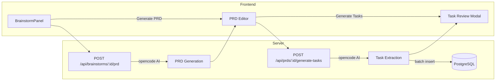
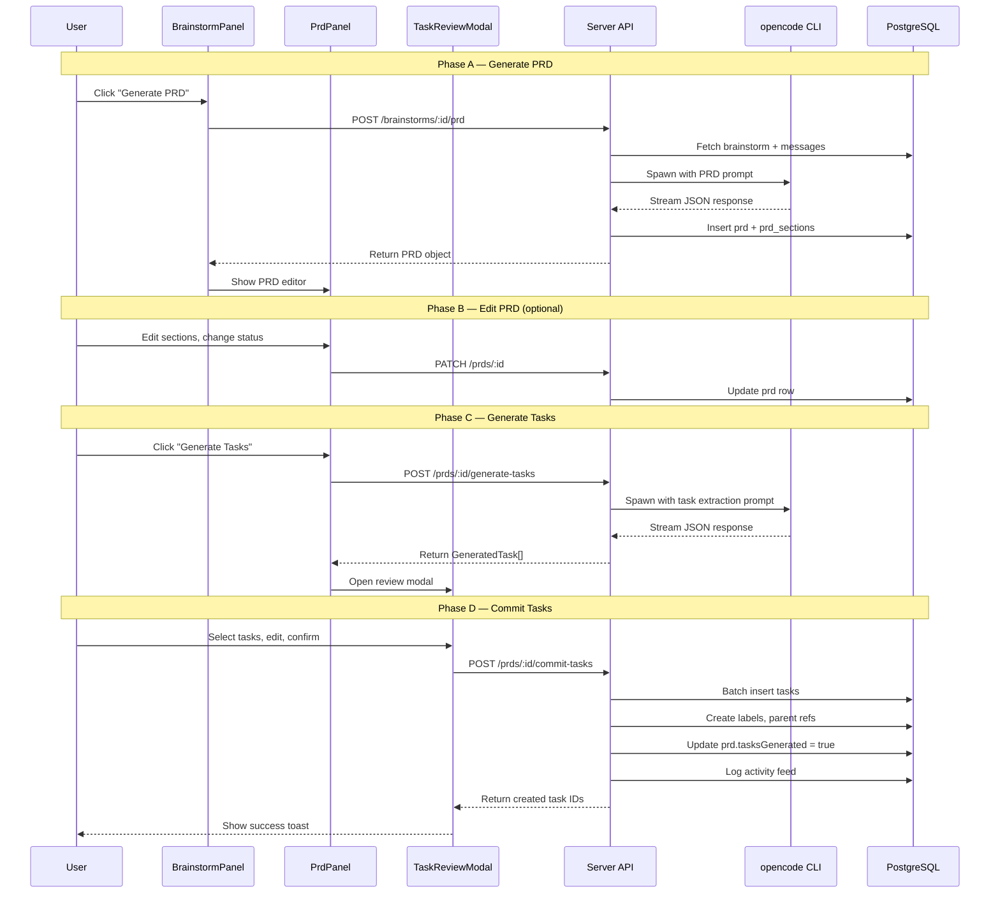

# Implementation Plan: Brainstorm → PRD → Task Pipeline

## Executive Summary

This plan adds a **two-step AI-powered pipeline** to Orbit:

1. **Brainstorm → PRD**: Synthesize an unstructured brainstorm conversation into a structured Product Requirements Document
2. **PRD → Tasks**: Parse the PRD into actionable tasks and batch-create them on a project's kanban board

The implementation follows Orbit's existing patterns: Nuxt 4 pages/components, Drizzle ORM schemas, server API routes with Zod validation, the `opencode` CLI for AI processing, and SSE streaming for real-time progress.

---

## Architecture Overview



---

## Phase 1: Database Schema

### 1.1 New Table: `prds`

Create [server/database/schema/prds.ts](file:///Users/zeinersyad/emdash-projects/orbit/server/database/schema/prds.ts)

```typescript
import { pgTable, uuid, varchar, text, timestamp, boolean } from 'drizzle-orm/pg-core'
import { relations } from 'drizzle-orm'
import { brainstorms } from './brainstorms'
import { projects } from './projects'
import { workspaces } from './workspaces'

export const prds = pgTable('prds', {
  id: uuid('id').primaryKey().defaultRandom(),
  brainstormId: uuid('brainstorm_id').notNull().references(() => brainstorms.id, { onDelete: 'cascade' }),
  workspaceId: uuid('workspace_id').notNull().references(() => workspaces.id, { onDelete: 'cascade' }),
  projectId: uuid('project_id').references(() => projects.id, { onDelete: 'set null' }),
  title: varchar('title', { length: 500 }).notNull(),
  content: text('content').notNull(),           // Full PRD markdown
  status: varchar('status', { length: 20 }).notNull().default('draft'),
  // status: 'draft' | 'review' | 'approved' | 'archived'
  version: integer('version').notNull().default(1),
  tasksGenerated: boolean('tasks_generated').notNull().default(false),
  createdAt: timestamp('created_at').defaultNow().notNull(),
  updatedAt: timestamp('updated_at').defaultNow().notNull().$onUpdate(() => new Date()),
})
```

**Fields explained:**
| Field | Purpose |
|-------|---------|
| `brainstormId` | Links PRD to its source brainstorm session |
| `projectId` | Optional association to a project (set when generating tasks) |
| `content` | Full PRD in markdown format (AI-generated, user-editable) |
| `status` | Workflow state: `draft` → `review` → `approved` → `archived` |
| `version` | Tracks regeneration count (user can re-generate from same brainstorm) |
| `tasksGenerated` | Flag indicating whether tasks have been batch-created from this PRD |

### 1.2 New Table: `prd_sections`

Create [server/database/schema/prd-sections.ts](file:///Users/zeinersyad/emdash-projects/orbit/server/database/schema/prd-sections.ts)

```typescript
export const prdSections = pgTable('prd_sections', {
  id: uuid('id').primaryKey().defaultRandom(),
  prdId: uuid('prd_id').notNull().references(() => prds.id, { onDelete: 'cascade' }),
  sectionType: varchar('section_type', { length: 50 }).notNull(),
  // sectionType: 'overview' | 'goals' | 'user_stories' | 'requirements' |
  //              'technical_spec' | 'acceptance_criteria' | 'milestones' | 'risks'
  title: varchar('title', { length: 255 }).notNull(),
  content: text('content').notNull(),
  position: integer('position').notNull().default(0),
  createdAt: timestamp('created_at').defaultNow().notNull(),
})
```

> [!NOTE]
> Sections are stored separately so the UI can render collapsible sections and the task generator can target specific sections (e.g., parse only `user_stories` and `requirements` for tasks).

### 1.3 Relations Update

Add to [server/database/schema/brainstorms.ts](file:///Users/zeinersyad/emdash-projects/orbit/server/database/schema/brainstorms.ts):

```diff
 export const brainstormsRelations = relations(brainstorms, ({ one, many }) => ({
   workspace: one(workspaces, { ... }),
   repository: one(repositories, { ... }),
   messages: many(brainstormMessages),
   attachments: many(brainstormAttachments),
+  prds: many(prds),
 }))
```

### 1.4 Export from Schema Index

Add to [server/database/schema/index.ts](file:///Users/zeinersyad/emdash-projects/orbit/server/database/schema/index.ts):

```diff
 export * from './brainstorm-attachments'
+export * from './prds'
+export * from './prd-sections'
```

### 1.5 Migration

```bash
npm run db:generate
npm run db:push
```

---

## Phase 2: Type Definitions

### 2.1 Add to [types/index.ts](file:///Users/zeinersyad/emdash-projects/orbit/types/index.ts)

```typescript
// ─── PRD ───
export type PrdStatus = 'draft' | 'review' | 'approved' | 'archived'

export interface Prd {
  id: string
  brainstormId: string
  workspaceId: string
  projectId: string | null
  title: string
  content: string
  status: PrdStatus
  version: number
  tasksGenerated: boolean
  createdAt: string
  updatedAt: string
  sections?: PrdSection[]
  brainstorm?: Brainstorm
}

export type PrdSectionType =
  | 'overview'
  | 'goals'
  | 'user_stories'
  | 'requirements'
  | 'technical_spec'
  | 'acceptance_criteria'
  | 'milestones'
  | 'risks'

export interface PrdSection {
  id: string
  prdId: string
  sectionType: PrdSectionType
  title: string
  content: string
  position: number
  createdAt: string
}

// ─── Generated Task (preview before commit) ───
export interface GeneratedTask {
  title: string
  description: string
  priority: TaskPriority
  estimateHours: number | null
  labels: string[]
  parentIndex: number | null  // For subtask grouping
  sectionSource: PrdSectionType  // Which PRD section this came from
}
```

---

## Phase 3: Server API Endpoints

### 3.1 PRD Generation (Brainstorm → PRD)

**`POST /api/brainstorms/[id]/prd`** — Create [server/api/brainstorms/[id]/prd.post.ts](file:///Users/zeinersyad/emdash-projects/orbit/server/api/brainstorms/%5Bid%5D/prd.post.ts)

This endpoint:
1. Fetches all messages from the brainstorm session
2. Fetches attached files metadata
3. Builds a structured prompt asking the AI to produce a PRD
4. Spawns `opencode` with the prompt (same pattern as [chat/index.get.ts](file:///Users/zeinersyad/emdash-projects/orbit/server/api/brainstorms/%5Bid%5D/chat/index.get.ts))
5. Parses the AI response into sections
6. Inserts a `prds` row + `prd_sections` rows
7. Returns the complete PRD

**Request body (Zod schema):**

```typescript
const generatePrdSchema = z.object({
  projectId: z.string().uuid().optional(),
})
```

**AI Prompt template:**

```
You are a senior product manager. Analyze the following brainstorm conversation 
and produce a structured Product Requirements Document (PRD).

[BRAINSTORM CONTEXT]
Title: ${brainstorm.title}
Repository: ${repoName || 'None'}

[CONVERSATION]
${messages.map(m => `[${m.role}]: ${m.content}`).join('\n\n')}

[OUTPUT FORMAT]
Return a JSON object with this exact structure:
{
  "title": "PRD title",
  "sections": [
    {
      "sectionType": "overview",
      "title": "Product Overview",
      "content": "markdown content..."
    },
    {
      "sectionType": "goals",
      "title": "Goals & Objectives",
      "content": "markdown content..."
    },
    {
      "sectionType": "user_stories",
      "title": "User Stories",
      "content": "As a [role], I want [feature] so that [benefit]..."
    },
    {
      "sectionType": "requirements",
      "title": "Functional Requirements",
      "content": "markdown content with numbered requirements..."
    },
    {
      "sectionType": "technical_spec",
      "title": "Technical Specification",
      "content": "markdown content..."
    },
    {
      "sectionType": "acceptance_criteria",
      "title": "Acceptance Criteria",
      "content": "markdown content..."
    },
    {
      "sectionType": "milestones",
      "title": "Milestones & Timeline",
      "content": "markdown content..."
    },
    {
      "sectionType": "risks",
      "title": "Risks & Mitigations",
      "content": "markdown content..."
    }
  ]
}
```

**Streaming vs. non-streaming decision:**

> [!IMPORTANT]
> PRD generation should use **SSE streaming** (like the brainstorm chat) so the user sees progress. The response can be large, and `opencode` takes 30–120 seconds. Use the same `createEventStream` + `spawn` pattern from [chat/index.get.ts](file:///Users/zeinersyad/emdash-projects/orbit/server/api/brainstorms/%5Bid%5D/chat/index.get.ts).

**Alternative: Non-streaming endpoint for simpler UX:**

If simplicity is preferred for v1, use a regular POST that:
- Shows a loading state in the UI
- Runs `opencode run --format json` synchronously via `execAsync` with a 3-minute timeout
- Returns the full PRD in one response

### 3.2 PRD CRUD

**`GET /api/brainstorms/[id]/prds`** — List PRDs for a brainstorm  
**`GET /api/prds/[id]`** — Get single PRD with sections  
**`PATCH /api/prds/[id]`** — Update PRD content, status, or sections  
**`DELETE /api/prds/[id]`** — Delete a PRD

Create these at:
- [server/api/brainstorms/[id]/prds.get.ts](file:///Users/zeinersyad/emdash-projects/orbit/server/api/brainstorms/%5Bid%5D/prds.get.ts)
- [server/api/prds/[id]/index.get.ts](file:///Users/zeinersyad/emdash-projects/orbit/server/api/prds/%5Bid%5D/index.get.ts)
- [server/api/prds/[id]/index.patch.ts](file:///Users/zeinersyad/emdash-projects/orbit/server/api/prds/%5Bid%5D/index.patch.ts)
- [server/api/prds/[id]/index.delete.ts](file:///Users/zeinersyad/emdash-projects/orbit/server/api/prds/%5Bid%5D/index.delete.ts)

### 3.3 Task Generation (PRD → Tasks)

**`POST /api/prds/[id]/generate-tasks`** — Create [server/api/prds/[id]/generate-tasks.post.ts](file:///Users/zeinersyad/emdash-projects/orbit/server/api/prds/%5Bid%5D/generate-tasks.post.ts)

This endpoint:
1. Fetches the PRD with its sections
2. Builds a prompt asking AI to extract actionable tasks
3. Spawns `opencode` with the prompt
4. Parses the JSON response into `GeneratedTask[]`
5. Returns the task list for **user review before committing**

**Request body:**

```typescript
const generateTasksSchema = z.object({
  projectId: z.string().uuid(),
  sections: z.array(z.string()).optional(),  // Filter which sections to extract from
})
```

**AI Prompt template:**

```
You are a project management expert. Analyze the following PRD and extract 
actionable development tasks.

[PRD TITLE]: ${prd.title}

[PRD CONTENT]:
${sections.map(s => `## ${s.title}\n${s.content}`).join('\n\n')}

[RULES]
- Each task must be small enough for one developer to complete in 1-3 days
- Group related tasks under parent tasks (epics)
- Assign priority: urgent, high, medium, low, or none
- Estimate hours for each task
- Suggest labels: feature, bugfix, improvement, refactor, documentation, testing
- Include clear acceptance criteria in the description

[OUTPUT FORMAT]
Return a JSON array:
[
  {
    "title": "Task title (imperative mood, max 100 chars)",
    "description": "Detailed description in markdown with acceptance criteria",
    "priority": "medium",
    "estimateHours": 8,
    "labels": ["feature"],
    "parentIndex": null,
    "sectionSource": "requirements"
  },
  {
    "title": "Subtask title",
    "description": "...",
    "priority": "medium",
    "estimateHours": 4,
    "labels": ["feature"],
    "parentIndex": 0,
    "sectionSource": "requirements"
  }
]
```

### 3.4 Task Commit (Confirm & Create)

**`POST /api/prds/[id]/commit-tasks`** — Create [server/api/prds/[id]/commit-tasks.post.ts](file:///Users/zeinersyad/emdash-projects/orbit/server/api/prds/%5Bid%5D/commit-tasks.post.ts)

This endpoint:
1. Receives the reviewed/edited task list from the frontend
2. Batch-inserts tasks into the `tasks` table (following the pattern in [tasks.post.ts](file:///Users/zeinersyad/emdash-projects/orbit/server/api/brainstorms/%5Bid%5D/tasks.post.ts))
3. Creates parent-child relationships for subtasks
4. Auto-assigns labels (creates if not existing, same as existing pattern)
5. Places all tasks in the project's backlog status
6. Logs activity feed entries
7. Marks `prd.tasksGenerated = true`
8. Returns created task IDs

**Request body:**

```typescript
const commitTasksSchema = z.object({
  projectId: z.string().uuid(),
  tasks: z.array(z.object({
    title: z.string().min(1).max(500),
    description: z.string().optional(),
    priority: z.enum(['none', 'urgent', 'high', 'medium', 'low']).default('none'),
    estimateHours: z.number().nullable().optional(),
    labels: z.array(z.string()).optional(),
    parentIndex: z.number().nullable().optional(),
  })),
})
```

---

## Phase 4: Composable

### 4.1 Create [composables/usePrd.ts](file:///Users/zeinersyad/emdash-projects/orbit/composables/usePrd.ts)

```typescript
import type { Prd, GeneratedTask } from '~/types'

const prds = ref<Prd[]>([])
const currentPrd = ref<Prd | null>(null)
const generatedTasks = ref<GeneratedTask[]>([])
const generating = ref(false)
const generatingTasks = ref(false)
const committing = ref(false)

export const usePrd = () => {
  // Fetch PRDs for a brainstorm
  async function fetchPrds(brainstormId: string) { ... }

  // Generate a new PRD from brainstorm
  async function generatePrd(brainstormId: string, projectId?: string) { ... }

  // Fetch single PRD with sections
  async function fetchPrd(prdId: string) { ... }

  // Update PRD content or status
  async function updatePrd(prdId: string, data: Partial<Prd>) { ... }

  // Generate task list from PRD (preview only)
  async function generateTasks(prdId: string, projectId: string) { ... }

  // Commit reviewed tasks to the project
  async function commitTasks(prdId: string, projectId: string, tasks: GeneratedTask[]) { ... }

  // Delete a PRD
  async function deletePrd(prdId: string) { ... }

  return {
    prds, currentPrd, generatedTasks,
    generating, generatingTasks, committing,
    fetchPrds, generatePrd, fetchPrd, updatePrd,
    generateTasks, commitTasks, deletePrd,
  }
}
```

---

## Phase 5: Frontend Components & Pages

### 5.1 Component: `PrdPanel.vue`

Create [components/prd/PrdPanel.vue](file:///Users/zeinersyad/emdash-projects/orbit/components/prd/PrdPanel.vue)

**Purpose:** Full-screen PRD editor/viewer within the brainstorm page.

**Layout:**

```
┌─────────────────────────────────────────────────────┐
│ ◆ PRD: Feature X Requirements           [Draft ▼]  │
│ From: "API Design Discussion" brainstorm            │
├─────────────────────────────────────────────────────┤
│                                                     │
│  ┌─ Overview ─────────────────────────────────┐     │
│  │ Product overview content...                │     │
│  └────────────────────────────────────────────┘     │
│                                                     │
│  ┌─ Goals & Objectives ──────────────────────┐     │
│  │ Goals content...                           │     │
│  └────────────────────────────────────────────┘     │
│                                                     │
│  ┌─ User Stories ─────────────────────────────┐     │
│  │ User stories content...                    │     │
│  └────────────────────────────────────────────┘     │
│  ... more collapsible sections ...                  │
│                                                     │
├─────────────────────────────────────────────────────┤
│  [🔄 Regenerate]    [✏️ Edit]    [📋 Generate Tasks] │
└─────────────────────────────────────────────────────┘
```

**Key features:**
- Collapsible markdown sections using the `prd_sections` data
- Inline editing with the existing TipTap editor (already in `package.json`)
- Status badge dropdown (Draft → Review → Approved)
- "Generate tasks" button → opens task review modal
- "Regenerate" button → re-runs AI with latest brainstorm messages

### 5.2 Component: `TaskReviewModal.vue`

Create [components/prd/TaskReviewModal.vue](file:///Users/zeinersyad/emdash-projects/orbit/components/prd/TaskReviewModal.vue)

**Purpose:** Review, edit, and confirm AI-generated tasks before committing to a project.

**Layout:**

```
┌────────────────────────────────────────────────────────┐
│  Review Generated Tasks                    [✕]         │
│  12 tasks extracted from "Feature X" PRD               │
├────────────────────────────────────────────────────────┤
│  Select project: [  My Project  ▼ ]                    │
│                                                        │
│  ☑ ◆ Set up authentication module         [high]  8h  │
│    ☑ ├─ Implement JWT token service       [med]   4h  │
│    ☑ ├─ Create login/register endpoints   [med]   4h  │
│    ☑ └─ Add password reset flow           [low]   3h  │
│  ☑ ◆ Design database schema               [high]  6h  │
│    ☑ ├─ Create user table migration       [med]   2h  │
│    ☑ └─ Add session management tables     [med]   2h  │
│  ☐ ◆ Write API documentation              [low]   4h  │
│                                                        │
│  ─────────────────────────────────────────────         │
│  Selected: 9/12 tasks · ~33 estimated hours            │
│                                                        │
│  [ Cancel ]                    [ Create 9 Tasks ]      │
└────────────────────────────────────────────────────────┘
```

**Key features:**
- Checkbox selection (select/deselect individual or all)
- Inline editing of task titles and priorities
- Parent-child grouping visualization (tree structure)
- Priority badges matching the existing kanban card style
- Estimate display
- Summary footer (count + total hours)
- Project selector dropdown (same as [BrainstormPanel.vue](file:///Users/zeinersyad/emdash-projects/orbit/components/brainstorm/BrainstormPanel.vue) create task modal)

### 5.3 Update: Brainstorm Page

Modify [pages/workspaces/[slug]/brainstorm.vue](file:///Users/zeinersyad/emdash-projects/orbit/pages/workspaces/%5Bslug%5D/brainstorm.vue) to:

1. Add a "Generate PRD" button in the `BrainstormPanel` header (next to Start/Stop)
2. Add a PRD tab/panel view that toggles between chat and PRD view
3. Show existing PRDs in the brainstorm sidebar with version badges

**Changes to the brainstorm sidebar item:**

```diff
 <div class="flex items-center gap-2 mb-1">
   <Icon name="lucide:lightbulb" ... />
   <span ...>{{ bs.title }}</span>
+  <span v-if="bs._prdCount" class="text-[10px] bg-purple-100 text-purple-600 px-1.5 py-0.5 rounded-full">
+    {{ bs._prdCount }} PRD{{ bs._prdCount > 1 ? 's' : '' }}
+  </span>
   <button ...>
     <Icon :name="bs.archived ? 'lucide:archive-restore' : 'lucide:archive'" ... />
   </button>
 </div>
```

### 5.4 Update: BrainstormPanel Header

Add a "Generate PRD" action to [components/brainstorm/BrainstormPanel.vue](file:///Users/zeinersyad/emdash-projects/orbit/components/brainstorm/BrainstormPanel.vue):

```diff
 <div class="flex items-center gap-2 flex-shrink-0">
+  <button
+    v-if="messages.length >= 2 && !isRunning"
+    class="text-[10px] font-semibold px-2.5 py-1.5 rounded-md bg-purple-500 text-white
+           hover:bg-purple-600 transition-colors flex items-center gap-1"
+    @click="$emit('generatePrd')"
+  >
+    <Icon name="lucide:file-text" class="w-3 h-3" />
+    Generate PRD
+  </button>
   <span v-if="isRunning" ...>Running</span>
   ...
 </div>
```

> [!TIP]
> The "Generate PRD" button only appears when there are at least 2 messages (a meaningful conversation has occurred) and the agent is not currently running.

---

## Phase 6: AI Integration Details

### 6.1 Opencode Invocation Pattern

Follow the exact pattern from [chat/index.get.ts](file:///Users/zeinersyad/emdash-projects/orbit/server/api/brainstorms/%5Bid%5D/chat/index.get.ts):

```typescript
const spawnArgs = [
  'run',
  '--format', 'json',
  '--dangerously-skip-permissions',
  '--dir', workDir,
  '--', fullPrompt,
]

const proc = spawn(opencodePath, spawnArgs, {
  cwd: workDir,
  stdio: ['ignore', 'pipe', 'pipe'],
  shell: false,
  env: minimalEnv,
})
```

### 6.2 Prompt Engineering: PRD Quality

The PRD prompt should enforce these quality standards:

- **Structured output**: JSON with predefined section types
- **Repository-aware**: When a repo is linked, reference actual file paths, technologies detected
- **Conversation-faithful**: Extract requirements from the actual brainstorm conversation, don't hallucinate features
- **Quantifiable goals**: Include metrics and success criteria where possible
- **Priority mapping**: Map urgency keywords from the conversation to requirement priorities

### 6.3 Prompt Engineering: Task Extraction

The task extraction prompt should enforce:

- **Atomic tasks**: Each task completable in 1-3 days by one developer
- **Imperative titles**: "Implement...", "Create...", "Add...", "Refactor..."
- **Acceptance criteria**: Every task description ends with "### Acceptance Criteria" section
- **No duplicate work**: Cross-reference existing tasks in the project if possible
- **Hierarchy**: Group related tasks under epics (parent tasks) for organization

### 6.4 JSON Extraction from Opencode Output

Opencode returns a stream of JSON events. The AI response text needs to be aggregated and then parsed. Create a utility:

```typescript
// server/utils/parse-ai-json.ts
export function extractJsonFromAiResponse<T>(rawText: string): T {
  // Try direct parse first
  try { return JSON.parse(rawText) } catch {}

  // Try extracting from markdown code fence
  const fenceMatch = rawText.match(/```(?:json)?\s*\n?([\s\S]*?)\n?\s*```/)
  if (fenceMatch) {
    return JSON.parse(fenceMatch[1].trim())
  }

  // Try finding JSON array or object boundaries
  const jsonMatch = rawText.match(/(\[[\s\S]*\]|\{[\s\S]*\})/)
  if (jsonMatch) {
    return JSON.parse(jsonMatch[1])
  }

  throw new Error('Could not extract JSON from AI response')
}
```

---

## Phase 7: Data Flow Diagram



---

## File Inventory

### New Files

| File | Layer | Description |
|------|-------|-------------|
| `server/database/schema/prds.ts` | Schema | PRD table definition |
| `server/database/schema/prd-sections.ts` | Schema | PRD sections table |
| `server/api/brainstorms/[id]/prd.post.ts` | API | Generate PRD from brainstorm (SSE) |
| `server/api/brainstorms/[id]/prds.get.ts` | API | List PRDs for a brainstorm |
| `server/api/prds/[id]/index.get.ts` | API | Get PRD with sections |
| `server/api/prds/[id]/index.patch.ts` | API | Update PRD |
| `server/api/prds/[id]/index.delete.ts` | API | Delete PRD |
| `server/api/prds/[id]/generate-tasks.post.ts` | API | Generate tasks from PRD (SSE) |
| `server/api/prds/[id]/commit-tasks.post.ts` | API | Batch-create tasks in project |
| `server/utils/parse-ai-json.ts` | Util | JSON extraction from AI output |
| `composables/usePrd.ts` | Composable | PRD state management |
| `components/prd/PrdPanel.vue` | Component | PRD editor/viewer |
| `components/prd/PrdSectionCard.vue` | Component | Collapsible PRD section |
| `components/prd/TaskReviewModal.vue` | Component | Task review before commit |
| `types/index.ts` | Types | New type definitions (modify existing) |

### Modified Files

| File | Change |
|------|--------|
| [server/database/schema/index.ts](file:///Users/zeinersyad/emdash-projects/orbit/server/database/schema/index.ts) | Export new schemas |
| [server/database/schema/brainstorms.ts](file:///Users/zeinersyad/emdash-projects/orbit/server/database/schema/brainstorms.ts) | Add `prds` relation |
| [types/index.ts](file:///Users/zeinersyad/emdash-projects/orbit/types/index.ts) | Add PRD types |
| [components/brainstorm/BrainstormPanel.vue](file:///Users/zeinersyad/emdash-projects/orbit/components/brainstorm/BrainstormPanel.vue) | Add "Generate PRD" button + emit |
| [pages/workspaces/[slug]/brainstorm.vue](file:///Users/zeinersyad/emdash-projects/orbit/pages/workspaces/%5Bslug%5D/brainstorm.vue) | Add PRD tab, integrate `usePrd`, handle PRD generation |

---

## Implementation Order (Recommended)

```mermaid
gantt
    title Implementation Phases
    dateFormat  X
    axisFormat %s

    section Phase 1 — Schema
    prds table + migration          :p1a, 0, 2
    prd_sections table              :p1b, 0, 1
    Schema relations & types        :p1c, after p1b, 1

    section Phase 2 — Core API
    POST brainstorms/:id/prd        :p2a, after p1c, 3
    PRD CRUD endpoints              :p2b, after p1c, 2
    parse-ai-json utility           :p2c, after p1c, 1

    section Phase 3 — Task API
    POST prds/:id/generate-tasks    :p3a, after p2a, 3
    POST prds/:id/commit-tasks      :p3b, after p3a, 2

    section Phase 4 — Frontend
    usePrd composable               :p4a, after p2b, 1
    PrdPanel + PrdSectionCard       :p4b, after p4a, 3
    TaskReviewModal                 :p4c, after p3b, 3
    BrainstormPanel updates         :p4d, after p4b, 1
    Brainstorm page integration     :p4e, after p4d, 2

    section Phase 5 — Polish
    Error handling & edge cases     :p5a, after p4e, 2
    Loading states & animations     :p5b, after p4e, 1
    Toast notifications             :p5c, after p5b, 1
```



> [!IMPORTANT]
> **Estimated total effort: ~25-30 hours**
> 
> - Phase 1 (Schema): 3h
> - Phase 2 (Core API): 6h
> - Phase 3 (Task API): 5h
> - Phase 4 (Frontend): 10h
> - Phase 5 (Polish): 4h

---

## Key Design Decisions

### Why separate PRD from brainstorm messages?

The brainstorm is a *conversation* — messy, exploratory, and linear. The PRD is a *document* — structured, editable, and versioned. Keeping them separate means:
- Users can regenerate PRDs without losing conversation history
- PRDs can be edited independently of the brainstorm
- Multiple PRDs can be generated from one brainstorm (different scopes)

### Why a two-step task generation (generate → review → commit)?

Direct creation (like the existing [convertToTask](file:///Users/zeinersyad/emdash-projects/orbit/composables/useBrainstorm.ts#L220-L231)) creates one task at a time. Batch generation needs human review because:
- AI may generate duplicate or overlapping tasks
- Priority assignments may need adjustment
- Some generated tasks may not be relevant
- Subtask grouping may need restructuring

### Why use opencode instead of direct LLM API calls?

The codebase already uses `opencode` exclusively for AI operations (see [chat/index.get.ts](file:///Users/zeinersyad/emdash-projects/orbit/server/api/brainstorms/%5Bid%5D/chat/index.get.ts)). This approach:
- Provides codebase-aware context (file reading, grep, etc.)
- Handles model selection and API keys centrally
- Maintains consistency with existing patterns
- Supports multiple providers without code changes

### Why `prd_sections` as a separate table?

Storing sections separately rather than as a JSON blob enables:
- Selective task generation from specific sections
- Independent section editing without re-parsing
- Section-level status tracking (future: per-section approval)
- More efficient queries (e.g., "show all user stories across PRDs")

---

## Edge Cases & Error Handling

| Scenario | Handling |
|----------|----------|
| Brainstorm has < 2 messages | Disable "Generate PRD" button; show tooltip explaining minimum conversation needed |
| AI returns malformed JSON | Use `extractJsonFromAiResponse` with multiple fallback parsers; show error toast if all fail |
| PRD generation times out | 5-minute timeout with SSE heartbeat; show "Generation timed out" error |
| User edits PRD then regenerates | Increment `version`, keep old content in activity log; confirm before overwriting |
| Project has no backlog status | Same handling as existing [tasks.post.ts](file:///Users/zeinersyad/emdash-projects/orbit/server/api/brainstorms/%5Bid%5D/tasks.post.ts#L47-L49): return 400 error |
| Opencode binary not found | Same handling as existing chat: show error in SSE stream |
| Network error during SSE stream | EventSource auto-reconnect (existing pattern) |
| User navigates away during generation | Process continues server-side; PRD saved on completion; user sees it when returning |
