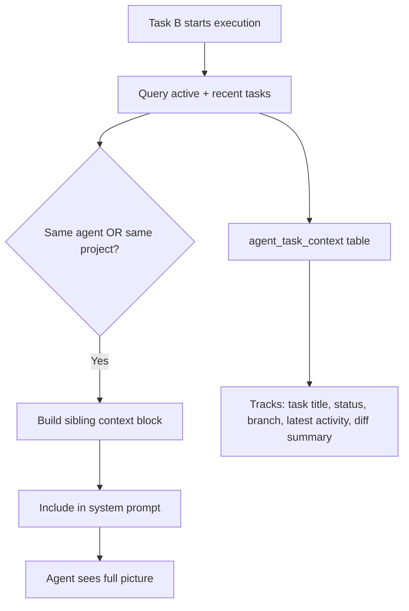

# Cross-Task Agent Context Awareness

## Problem

When an agent is working on Task A and then starts Task B, the agent on Task B has **zero visibility** into:
- What Task A (or any other task) is about
- What the agent already did on Task A (commits, files changed, status)
- Whether other agents are currently working on related tasks

This isolation causes:
- Duplicate work across tasks
- Conflicting code changes
- Agents unable to reference their own prior work
- No coordination between agents in the same project

## Solution

Inject a **[SIBLING TASKS CONTEXT]** section into the agent's system prompt that summarizes what other tasks the same agent (or other agents in the same project) are currently working on or have recently completed.

## Architecture



## Implementation Phases

### Phase 1: New DB Table — `agent_task_context`

A lightweight table that caches the latest context snapshot for each active agent-task pair. Updated on every agent run start/completion.

| Column | Type | Purpose |
|--------|------|---------|
| `id` | uuid | PK |
| `task_id` | uuid | FK → tasks |
| `agent_id` | uuid | FK → agents |
| `project_id` | uuid | FK → projects |
| `status` | varchar | running / completed / error |
| `branch_name` | varchar | Git branch being used |
| `summary` | text | Latest activity summary (what the agent did) |
| `files_changed` | jsonb | List of files modified |
| `started_at` | timestamp | When execution started |
| `completed_at` | timestamp | When execution finished |
| `updated_at` | timestamp | Last update |

### Phase 2: API Endpoint — `GET /api/tasks/:id/sibling-context`

Returns the context of all related tasks for a given task:
- Tasks assigned to the **same agent**
- Tasks in the **same project** being worked on by **any agent**
- Filters to only **running** or **recently completed** (last 24h)

### Phase 3: System Prompt Injection in `execute.get.ts`

Before spawning opencode, query sibling context and inject a `[SIBLING TASKS CONTEXT]` block:

```
[SIBLING TASKS CONTEXT — Other tasks in this project]
You are not working in isolation. Here are other tasks being handled by agents in the same project:

1. **Task: "Fix login page styling"** (Agent: Nova, Status: RUNNING)
   - Branch: task-fix-login-page-styling
   - Files changed: components/LoginForm.vue, assets/css/auth.css
   - Latest: Changed button colors from blue to purple, added hover animation

2. **Task: "Add user settings page"** (Agent: Nova, Status: COMPLETED 2h ago)
   - Branch: task-add-user-settings
   - Files changed: pages/settings.vue, composables/useSettings.ts
   - Summary: Created full settings page with profile editing
   
IMPORTANT: Be aware of these parallel tasks to avoid conflicts. Do NOT modify files that other running agents are actively editing unless absolutely necessary. If your task relates to completed work, you can reference those branches.
```

### Phase 4: Enrich Health Endpoint

Extend `GET /api/agents/health` to return `currentTasks` for each agent so the frontend can display what each agent is working on.

### Phase 5: Frontend — Agent Activity Panel

Add a "Current Tasks" section to the agent panel on [agents.vue](file:///Users/zeinersyad/emdash-projects/orbit/pages/agents.vue) showing what each agent is actively working on.

## Files to Create/Modify

| File | Action | Description |
|------|--------|-------------|
| [agent-task-context.ts](file:///Users/zeinersyad/emdash-projects/orbit/server/database/schema/agent-task-context.ts) | **Create** | New schema table |
| [schema/index.ts](file:///Users/zeinersyad/emdash-projects/orbit/server/database/schema/index.ts) | Modify | Export new schema |
| `migrations/0023_agent_task_context.sql` | **Create** | Migration SQL |
| [sibling-context.get.ts](file:///Users/zeinersyad/emdash-projects/orbit/server/api/tasks/[id]/sibling-context.get.ts) | **Create** | New API endpoint |
| [execute.get.ts](file:///Users/zeinersyad/emdash-projects/orbit/server/api/tasks/[id]/execute.get.ts) | Modify | Inject sibling context into prompt |
| [health.get.ts](file:///Users/zeinersyad/emdash-projects/orbit/server/api/agents/health.get.ts) | Modify | Return current tasks per agent |
| [types/index.ts](file:///Users/zeinersyad/emdash-projects/orbit/types/index.ts) | Modify | Add AgentTaskContext type |
| [agents.vue](file:///Users/zeinersyad/emdash-projects/orbit/pages/agents.vue) | Modify | Show agent's current tasks |
